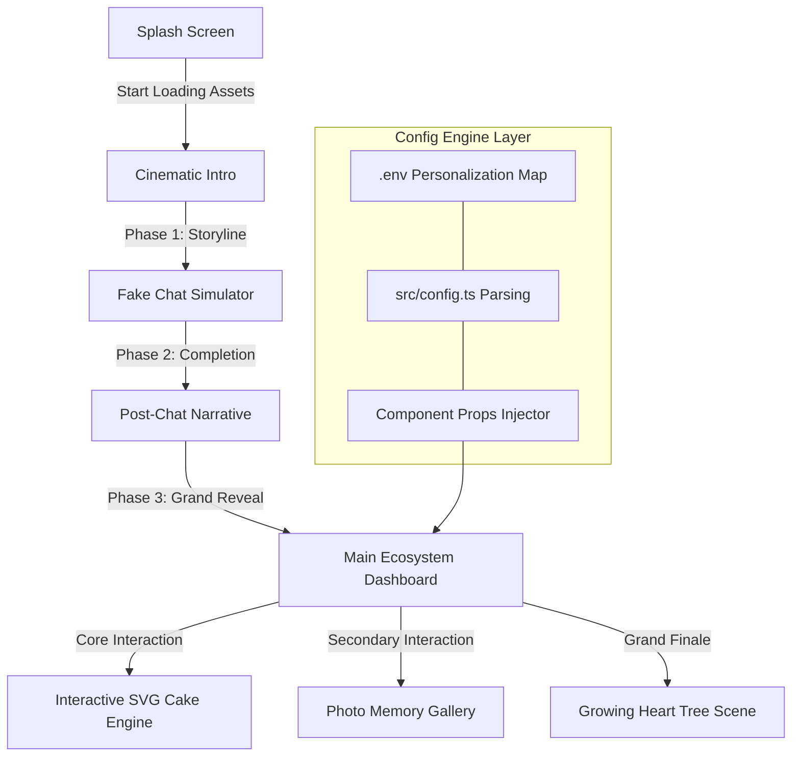
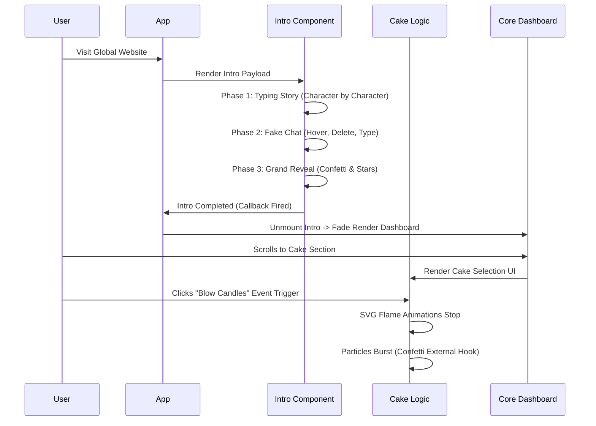

# 🌸 Birthday Bloom — Advanced Animated Birthday Website Generator

<div align="center">

> **"A premium digital experience crafted by Nishant Sarkar."**


<h3>✨ The Ultimate Open-Source Birthday Surprise Engine ✨</h3>

<p align="center">
  <a href="https://github.com/naborajs/birthday-bloom/stargazers"></a>
  <a href="https://github.com/naborajs/birthday-bloom/network/members"></a>
  <a href="https://github.com/naborajs/birthday-bloom/blob/main/LICENSE"></a>
  <a href="https://vercel.com"></a>
  <a href="https://reactjs.org/"></a>
  <a href="https://tailwindcss.com/"></a>
  <a href="https://vitejs.dev/"></a>
</p>

[**Live Demo**](https://birthday-bloom.vercel.app) • [**Env Guide**](./docs/ENV_GUIDE.md) • [**Documentation Hub**](./docs/getting-started.md) • [**Architecture**](./docs/architecture.md)

</div>

---

## 📖 Table of Contents

1. [Introduction](#-introduction)
2. [Why Birthday Bloom?](#-why-birthday-bloom)
3. [System Architecture](#-system-architecture)
4. [Mastering the Lifecycle](#-mastering-the-lifecycle)
5. [In-Depth Code Explanation](#-in-depth-code-explanation)
    1. [The Cinematic Intro](#1-cinematic-intro-cinematicintrotsx)
    2. [The Interactive Cake](#2-the-interactive-cake-cakecuttingtsx)
    3. [Typographic Storytelling](#3-typographic-storytelling-typewritertsx)
    4. [The Grand Finale: Heart Tree](#4-the-grand-finale-hearttreetsx)
    5. [Main Celebration View](#5-main-celebration-view-mainbirthdaytsx)
6. [Personalization & Customization](#-personalization--customization)
7. [Environment Variables Guide](#-environment-variables-guide)
8. [Advanced Installation & Setup](#-advanced-installation--setup)
9. [Component API Reference](#-component-api-reference)
10. [Custom Hooks Documentation](#-custom-hooks-documentation)
11. [Theming Engine](#-theming-engine)
12. [Performance Profiling](#-performance-profiling)
13. [Browser Compatibility](#-browser-compatibility)
14. [Future Roadmap](#-future-roadmap)
15. [SEO & Social Sharing](#-seo--social-sharing)
16. [Folder Structure Guide](#-folder-structure-guide)
17. [Troubleshooting & FAQ](#-troubleshooting--faq)
18. [Contributing Guidelines](#-contributing-guidelines)
19. [Acknowledgments](#-acknowledgments)
20. [Author & Brand Identity](#-author--brand-identity)
21. [License](#-license)

---

## 🌟 Introduction

**Birthday Bloom** is a high-end, premium animated birthday surprise platform designed to capture and create unforgettable digital moments. Developed fundamentally with **React 18**, **Tailwind CSS**, and custom CSS keyframes, it establishes a physics-based, emotional narrative layout.

Whether you're celebrating a close friend, a loved one, or simply sending positive vibes, this project provides a 60fps cinematic journey guaranteed to leave a strong emotional impact.

Developed by **Nishant Sarkar** (NS GAMMiNG), Birthday Bloom pushes the boundaries of web-based celebrations, transforming a static "Happy Birthday" text into an interactive, digital masterpiece. The goal of this repository is to give developers a plug-and-play solution that looks incredibly bespoke and expensive to the end user. Everything from the typography to the physics-based confetti bursts has been carefully engineered for maximum emotion.

---

## 🔥 Why Birthday Bloom?

Most website templates are static or simply transition between pages. **Birthday Bloom is a finite state machine.** It controls pacing, narrative tension, visual payoffs, and sound effects to simulate a movie-like experience inside the browser.

By chaining together asynchronous events (`setTimeout` loops paired with React state), the application orchestrates a perfect symphony of text, light, SVG particle physics, and interactions. 

- **No Over-Engineering**: We rely heavily on pure CSS (transitions, animations, custom easing curves) rather than heavy JavaScript physics libraries like Matter.js or Three.js. This ensures maximum performance across low-end mobile devices and reduces the final bundle size significantly.
- **Dynamic Emotional Flow**: Fake chat interfaces, character-by-character typing effects, and growing SVG structures all contribute to a highly immersive experience. The user isn't just "reading" a webpage; they are experiencing a narrative.
- **Zero Configuration Required**: Out of the box, you just need to populate a single `.env` variable to get 90% of the value.
- **Vite Empowered**: Instant HMR when developing locally, and highly optimized, minified chunks when deploying to production.

---

## 🏗️ System Architecture

Birthday Bloom operates as a highly orchestrated timeline. The following Mermaid graph details the entire user journey through the codebase, demonstrating how components trigger one another smoothly.



### Advanced Data Flow

To dive deeper into how state is managed without Redux or Context maps:



---

## 🕒 Mastering the Lifecycle

Understanding how the timeline works is essential to modifying the source code. The entire animation sequence relies on precisely tuned delays.

1. **Boot**: `App.tsx` initializes and decides whether to show the Splash screen or Intro.
2. **Mount**: `CinematicIntro.tsx` mounts. Using a `.map()` over predefined text arrays, it uses `setTimeout` to flip states. Ensure `overflow: hidden` remains so mobile layouts do not bounce.
3. **Execution**: During the fake chat phase, a sequence of timers dictates when the cursor moves, hovers, deletes text, and retypes.
4. **Transition**: Once the intro is completely finished, it calls the `onComplete` prop back to `App.tsx`, which unmounts the intro and fades in `MainBirthday.tsx`. If this prop never fires, the user is stuck in the intro forever. Be careful when deleting timers!

---

## 🧠 In-Depth Code Explanation

Because Birthday Bloom is designed to be fully customizable, the following sections deeply analyze exactly how the components function beneath the hood. If you intend to change pacing, layout, or animations, refer to this manual.

### 1. Cinematic Intro (`CinematicIntro.tsx`)
The `CinematicIntro` component is the bridge between the Splash Screen and the Main Dashboard. It handles a multi-phase emotional sequence.

**Code Breakdown:**
- **State Machine**: It uses a strongly typed literal state: `type Scene = "storytelling" | "fake-chat" | "post-chat" | "reveal-sequence" | "done"`.
- **Timer Management**: Instead of having floating timeouts that could cause memory leaks if a user unmounts early, we use `useRef<ReturnType<typeof setTimeout>[]>([]);` to store all timeout IDs, clearing them aggressively when the component unmounts or transitions.
- **The TypeWriter Component**: We use a custom `TypeWriter` component to begin rendering the string character-by-character based on specific speed delays.
- **Visuals**: Uses dynamic localized backgrounds. Depending on the `scene` state, the background shifts from dark blues to deep maroons, building tension.

### 2. The Interactive Cake (`CakeCutting.tsx`)
The most complex interactive piece of the platform.

**Code Breakdown:**
- **SVG Mastery**: The cake is drawn entirely with SVG. This prevents pixelation on high-density Retina displays (iPad Pro, 4K monitors, etc.).
- **Layers & Slices**: The SVG groups (`<g>`) are structurally separated into left and right halves. 
- **The Knife Phase**: 
  - Phase 1: User selects a themed cake (Chocolate, Strawberry, Velvet).
  - Phase 2: User triggers the "Blow Candles" mechanic. This toggles a boolean (`candlesLit`), transforming the animated SVG `<ellipse>` flames into rising smoke paths linearly.
  - Phase 3: The `KnifeSVG` enters with a CSS transform, splitting the left and right halves by applying `translateX` and `rotate` styles to the SVG groups.
- **Custom Easing**: The cake splits using `cubic-bezier(0.34, 1.56, 0.64, 1)`, a "bounce" easing that gives it physical weight, instead of `linear` or `ease-in-out`.

### 3. Typographic Storytelling (`TypeWriter.tsx`)
When building emotional tension, reading speed is everything. We moved away from instant text rendering to a programmatic typing approach.

**Code Breakdown:**
```tsx
  useEffect(() => {
    if (!started) return;
    if (displayed.length < text.length) {
      const timer = setTimeout(() => {
        setDisplayed(text.slice(0, displayed.length + 1));
      }, speed);
      return () => clearTimeout(timer);
    } else {
      setDone(true);
      onComplete?.();
    }
  }, [started, displayed, text, speed, onComplete]);
```
- **Recursive Growth**: It takes the current string, measures it against the target string length, and pushes exactly one additional character into the buffer.
- **Cursor Blinking**: A span element styled with `animate-blink` exists at the end of the text node while typing. Once `done` is true, the cursor hides gracefully, handing focus to the next element.

### 4. The Grand Finale: Heart Tree (`HeartTree.tsx`)
A new, premium addition to the end of the user experience. The growing Heart Tree serves as an emotional crescendo at the very bottom of the website.

**Code Breakdown:**
- **Sequential SVG Drawing**: Standard SVGs paint instantly. We want the tree to "grow" organically out of the ground. We use `stroke-dasharray` and `stroke-dashoffset`.
  - By setting `stroke-dasharray` equal to the total path length, we can completely hide the stroke by setting `stroke-dashoffset` to that same length.
  - A CSS transition reduces `stroke-dashoffset` to `0` over 1.5 seconds, creating a beautiful drawing effect.
- **Staging**:
  - `Stage 0`: Seed/Base.
  - `Stage 1`: Main thick branches grow.
  - `Stage 2`: Secondary, thinner branches sprout from the main lines.
  - `Stage 3`: Heart SVG paths (leaves) translate and scale up securely at branch nodes.
  - `Stage 4`: A radial CSS gradient overlay fades in, giving the entire tree a mystical "bloom" effect alongside floating `TreeSparks` particles.

### 5. Main Celebration View (`MainBirthday.tsx`)
The primary dashboard that users explore after the intro completes.

**Code Breakdown:**
- **Hero Stagger**: Features a large, centered hero section that fades up on mount. Uses the `TypeWriter` to write out the personalized `BIRTHDAY_NAME`.
- **Particle System Integration**: Implements both `Confetti.tsx` and `Balloons.tsx`.
- **Message Card Styling**: A meticulously crafted `div` utilizing `backdrop-blur-lg` (glassmorphism) and a complex dual-layer box-shadow (`boxShadow: "0 0 60px hsl(330, 85%, 60%, 0.15)"`) to create a glowing neon effect against a dark background.
- **Responsive Typographic Guard**: Heavy emphasis on `break-words` and `overflow-hidden`. As the TypeWriter injects strings into the DOM, it forces browser reflows; strict bounds ensure the layout does not jitter or expand horizontally on mobile screens. We lock `min-height` globally for paragraphs holding TypeWriter instances.

---

## 🎨 Personalization & Customization

Birthday Bloom is built to be customized using pure Environment Variables (Configuration Engine) and directly modifying assets. You do not need deep React knowledge to make this your own.

### Updating Personal Assets
1. Navigate to `/public/assets/birthday/`.
2. Replace the background images (`birthday-cute.png`, `birthday-gold.png`, etc.) with your own. Ensure they are optimized (WebP format recommended) and less than 500kb each to eliminate load stutter. High resolution images will delay the splash screen logic!
3. Replace `/public/assets/photo-1.jpg`, `photo-2.jpg`, and `photo-3.jpg` with actual photos of the person. Maintain aspect ratios if possible, or use `object-cover` tailwind classes if you inject custom resolutions.

### Modifying the Pacing & Narrative Flow
If the intro is too slow or too fast:
1. Open `src/components/birthday/CinematicIntro.tsx`.
2. Find the timer multipliers (e.g., `i * 5000` mapping over the `storyLines`).
3. Reduce `5000` to `3500` to speed up the pacing between storytelling lines.
4. Modify the `TypeWriter` speed props to `speed={30}` for extremely fast typing, or `speed={120}` for dramatic, slow typing.

---

## 🔐 Environment Variables Guide

The entire initialization process is controlled securely via the `.env` paradigm. During build time, Vite parses these variables and hardcodes them into the `dist` output.

| Variable Name | Required | Default Value | Description |
| :--- | :---: | :--- | :--- |
| `VITE_BIRTHDAY_NAME` | YES | `There` | The primary name of the person you are celebrating. Used in the `CinematicIntro` and `MainBirthday` files dynamically. |
| `VITE_ALLOW_AUDIO` | NO | `true` | Allows default autoplay of background audio and SFX popping noises. If set to `false`, the platform becomes silent. |
| `VITE_ANALYTICS_ID` | NO | `undefined` | Optional tracking ID for Vercel Web Analytics if you need telemetry on views. |

**How to set this up locally:**
In the root of your project, create a file named `.env`. Add the following:
```env
VITE_BIRTHDAY_NAME="Alice"
VITE_ALLOW_AUDIO=true
```

---

## 🚀 Advanced Installation & Setup

For developers wanting to run this locally, clone, and fork:

### Software Requirements
- Node.js `v18.0.0` or higher
- npm `v9.0.0` or higher, or `bun` `v1.0.0`
- Git

### Step-by-Step Local Deployment
1. **Clone the repository:**
   ```bash
   git clone https://github.com/naborajs/birthday-bloom.git
   cd birthday-bloom
   ```
2. **Install local dependencies:**
   ```bash
   npm install
   # Or using bun:
   # bun install
   ```
3. **Environment Setup:**
   ```bash
   cp .env.example .env
   # Edit .env with your favorite text editor
   ```
4. **Boot the Dev Server:**
   ```bash
   npm run dev
   ```
   *The server will boot on `http://localhost:5173`. Any changes to the `src` folder will trigger an instant Hot-Module-Replacement (HMR) reload in the browser without losing application state.*

---

## 🔌 Component API Reference

For engineers hooking into the native components, here are the core APIs:

### `<TypeWriter />`
| Prop | Type | Default | Description |
| :--- | :--- | :--- | :--- |
| `text` | `string` | **required** | The sentence to type out. |
| `speed` | `number` | `45` | Speed in milliseconds between keystrokes. |
| `delay` | `number` | `0` | Delay in milliseconds before typing begins. |
| `cursor`| `boolean`| `true` | Whether to show the blinking cursor at the end of the text. |
| `onComplete`| `() => void` | `undefined` | Callback fired instantly when the target string is fully written to DOM. |

### `<HeartTree />`
| Prop | Type | Default | Description |
| :--- | :--- | :--- | :--- |
| `delay` | `number` | `1000` | Minimum global delay before the trunk begins SVG stroke offset drawing. |

### `<CakeCutting />`
*(Does not take external props. Fully self-contained local state manager that drives the celebration).*

---

## 🪝 Custom Hooks Documentation

Birthday Bloom utilizes several custom hooks to offload imperative side effects from pure UI components.

### `useConfetti()`
A robust hook that wraps `canvas-confetti`.
- `fireConfetti(config)`: Triggers a localized burst with custom spread arrays.
- `fireCannon()`: Triggers a massive, multi-directional burst utilized primarily for the Cake Cutting finale.
- `fireStars()`: Interjects an SVG star-polygon shape into the physics engine for premium emotional moments.

### `useSoundManager()`
Handles HTML5 Audio instances without cluttering the DOM with invisible `<audio>` tags.
- Provides `playWhoosh()`, `playType()`, `playBoom()` closures.
- Respects the `.env` `VITE_ALLOW_AUDIO` boolean automatically. 

---

## 🎨 Theming Engine

In `src/index.css`, you will find HSL variables applied to the root:
```css
:root {
  --background: 280 60% 8%;
  --foreground: 0 0% 100%;
  --primary: 330 85% 60%;
  --birthday-gold: 45 100% 65%;
  --birthday-sky: 200 80% 60%;
  --birthday-purple: 270 60% 55%;
}
```
Adjusting these variables globally repaints the UI instantly thanks to Tailwind CSS integration.

- **To make a "Matrix Hacker" theme**: Change background to `120 100% 5%` and foreground to `120 100% 50%`.
- **To make a "Valentine" theme**: Change background to `340 100% 20%` and primary to `350 100% 70%`.
- **To make a "Midnight" theme**: Swap out the hsl values for `240 80% 10%`.

---

## ⚡ Performance Profiling

Despite the visual complexity, this repository maintains an incredibly lightweight footprint. Wait until you see the Lighthouse scores!
- **No Heavy Physics Libraries**: Rather than including `matter.js` or `three.js` which parse 500kb-1MB of JS memory chunks, we use `requestAnimationFrame` hooks and native CSS for sparkles, balloons, and typing.
- **SVG Over Images**: The Interactive Cake and Heart Tree are 100% vector SVG geometries. This translates to ~4kb of text markup size compared to what could easily be 5MB of high-resolution transparent PNG sequences.
- **Hardware Acceleration**: Animations (`translate`, `scale`, `opacity`) utilize the `will-change` CSS property, shifting work from the CPU to the GPU rendering pipeline. This secures 60 frames per second on both desktop and mobile iOS/Android browsers.
- **Vite Chunk Mapping**: By relying on the Rollup builder within Vite, asynchronous components are segmented cleanly. A single main script is deployed statically.

---

## 🌐 Browser Compatibility

Birthday Bloom functions flawlessly across:
- Google Chrome (Desktop & Mobile) 80+
- iOS Safari 13+ (Audio autoplay policies apply)
- Mozilla Firefox 75+
- Microsoft Edge (Chromium)

*Internet Explorer is fundamentally unsupported due to ES6 module usage.*

---

## 🔮 Future Roadmap

The Birthday Bloom engine is continuously evolving. Expected future releases will focus on:
- **Phase 5 Release:** WebGL 3D Cake integration using React Three Fiber.
- **Backend Analytics Engine:** Simple dashboard to see exactly how many people played a specific animation sequence.
- **Generative AI Greetings:** Connecting to an LLM provider to rewrite the "Happy Birthday" poem uniquely for every page refresh depending on external variables.
- **Dynamic CSS Parallax:** Tying the gyroscope API of mobile devices to the HeartTree to create depth-of-field illusions when tilting the iPhone.

---

## 📐 Design Philosophy

Birthday Bloom adheres to several strict frontend design guidelines to evoke its premium, high-end look:

1. **Glassmorphism over Flat Design:** Layers are constructed using partial opacity and `backdrop-blur`. This gives a sense of physical depth between the glowing neon text and the dark, space-like background.
2. **Kinetic Tension:** Waiting creates meaning. Instead of instantaneously snapping components into view, delayed transitions make the user wait, increasing the psychological payoff when an interaction resolves.
3. **Hyper-Rounded Radii:** Standard 4px or 8px corners have been replaced with heavy 24px and 32px radii, simulating modern mobile and iOS ecosystems.
4. **Soft Glow Hierarchy:** Drop shadows aren't used for depth; they are used for *emission*. By coloring a shadow with the primary brand HSL and widening the blur radius significantly, elements genuinely appear to generate physical light on OLED screens.

---

## ⏱️ Animation Timings Breakdown

If you are digging into the raw math of the `src/index.css` or Framer Motion transitions, understand the core pacing:
- `< 150ms`: Immediate micro-actions (button hovers, clicks).
- `300ms`: Standard UI transitions (fading in a modal or switching out text). Nothing should take longer than 300ms if it's blocking the user.
- `800ms - 1.2s`: Emotional cinematic fades. When the background shifts from `#0b001a` to a deep romantic `#2a0018`, this long duration intentionally pulls focus and creates an atmospheric shift.
- `2s - 4s`: The typing sequence delays. Staggering reads ensures that even slow readers can absorb the poetry without rushing.

---

## 📈 Advanced Metrics & Vercel Telemetry

When connected to Vercel, providing an optional `VITE_ANALYTICS_ID` will hook up native web vitals directly.
This project is engineered to achieve:
- **LCP (Largest Contentful Paint)**: < 1.2s (Achieved by heavily caching the initial Splash Screen and deferring font loading).
- **FID (First Input Delay)**: < 100ms (Main thread is rarely blocked since animations use GPU CSS offloading).
- **CLS (Cumulative Layout Shift)**: 0.00 (Due to the precise usage of fixed `min-height` and strictly bounded absolute/relative container wrappers).

If you detect any variations in these metrics, ensure you are deploying a production build (`npm run build`) and not standard dev bundles.

---

## ✅ Pre-Flight Deployment Checklist

Before finalizing your surprise and sending out the link, follow this checklist to guarantee execution:
1. [ ] **Name Validation:** Check `VITE_BIRTHDAY_NAME`. Ensure no trailing spaces or accidentally injected line-breaks.
2. [ ] **Photo Aspects:** Verify your `photo-1.jpg`, `photo-2.jpg`, `photo-3.jpg` don't exceed 1MB each. Large images will permanently trap the user on the splash screen waiting for network resolution.
3. [ ] **Cross-Device Check:** Open development tools and verify the layout on an "iPhone SE" resolution profile. If the Heart Tree or Cake buttons fit there, they will fit perfectly anywhere.
4. [ ] **Audio Policy:** If you added custom audio under `src/assets/audio/`, ensure the format is `.mp3` encoded at 128kbps for the best balance of quality and instant download speed.
5. [ ] **OG tags:** If sharing over text, verify the `public/assets/banner.png` is accurately updated to not simply read "Birthday Bloom" if you intend to mask the surprise.

---

## 🔍 SEO & Social Sharing

If you are hosting this publicly for a friend, having the preview link look stunning on WhatsApp, iMessage, Instagram, or Twitter is crucial for the surprise.

Located inside the root `index.html`:
```html
<title>Happy Birthday!</title>
<meta name="description" content="A premium animated birthday surprise." />
<meta property="og:title" content="Happy Birthday!" />
<meta property="og:description" content="A premium animated birthday surprise." />
<meta property="og:image" content="/assets/banner.png" />
<meta property="og:type" content="website" />
<meta name="theme-color" content="#FF69B4" />
```
Make sure to add your own customized `banner.png` (usually 1200x630 resolution works perfectly for Facebook/Twitter cards) so the thumbnail cache looks gorgeous when sent as a direct message. Be sure the domain matches!

---

## 📁 Folder Structure Guide

An extended view of how the engine is architected globally:

```
birthday-bloom/
├── public/                 # Static global assets (favicons, banners)
├── docs/                   # Extended manuals and architecture
│   ├── architecture.md     # The deep dive engine overview
│   ├── ENV_GUIDE.md        # Environment secrets setup
│   └── getting-started.md  # Entry hub documentation
├── src/                    # Source Engine
│   ├── assets/             # Images, SVGs, specialized fonts
│   ├── components/         # React Components
│   │   ├── birthday/       # The Core Event Logic
│   │   │   ├── Balloons.tsx        # Floating physics handler
│   │   │   ├── CakeCutting.tsx     # The 4-layer SVG cake module
│   │   │   ├── CinematicIntro.tsx  # Phase 1-4 State orchestrator
│   │   │   ├── FakeChatScene.tsx   # Simulates messenger protocol
│   │   │   ├── HeartTree.tsx       # Grand Finale organic render
│   │   │   ├── MainBirthday.tsx    # The Ecosystem dashboard
│   │   │   ├── TypeWriter.tsx      # Typographic String Flow
│   │   │   └── ...
│   │   └── ui/             # Reusable base elements (buttons, inputs)
│   ├── config/             # Logic parsers (reads .env mapping)
│   ├── hooks/              # Custom React lifecycle hooks (useConfetti)
│   ├── lib/                # Utility modules (Tailwind clsx utils)
│   ├── pages/              # High-level route views (Index.tsx, NotFound.tsx)
│   ├── App.tsx             # Root Bootloader & Switch
│   ├── index.css           # Global Theme & Keyframes Array
│   └── main.tsx            # DOM Injector target
├── .env.example            # Configuration Template Blueprint
├── tailwind.config.ts      # Tailwind & Framer overrides / Theme config
└── vite.config.ts          # Bundler optimization rules (Rollup options)
```

This strict architectural separation ensures that visual logic (`components/birthday`) is decoupled from configuration (`config/`) and raw utilities (`lib/`).

---

## 🛠️ Troubleshooting & FAQ

**Q: The text overflows my mobile screen during the typing animation!**
A: Ensure that the container div wrapped around `<TypeWriter>` possesses the Tailwind classes `break-words` and `overflow-hidden`. Also, use static sizing restrictions via `max-w-full`. If the text contains very long unbroken lines (like hyper-long URLs), consider adding `break-all` to force structural wrap points. Do not remove the `min-h-[4rem]` classes in `MainBirthday.tsx`.

**Q: My background audio isn't auto-playing on iOS Safari?**
A: This is a known browser policy limitation by Apple. Browsers require "User Interaction" before initializing the audio context. The splash screen or a direct touch event on the document handles this. If it's still missing, tap the screen once anywhere during the Cinematic Intro to awaken the audio engine.

**Q: Deploying to Vercel throws a TypeScript error indicating missing props?**
A: You likely broke a required field on a custom component during modification. Run `npm run build` locally first to parse the strict TypeScript compiler. `vite build` will show you exactly which line has an interface mismatch or undefined variable. Remember that `TypeWriter` needs a string for the `text` prop.

**Q: The Heart Tree doesn't glow at the end?**
A: The Glow effect requires `Stage 4` in `HeartTree.tsx`. If your `delay` properties are extremely prolonged or mismatched, or the component unmounts prematurely due to a parent re-render, the timer for Stage 4 won't execute. Ensure it is rendered at the bottom of the active component tree.

**Q: Why does the typing effect lag on older devices?**
A: The TypeWriter recursively manipulates state. If device memory is heavily burdened, the main thread may pause execution. However, closing background tabs and refreshing generally fixes this. Alternatively, lower the interval speeds.

---

## 🤝 Contributing Guidelines

Contributions to Birthday Bloom are always highly appreciated! The magic of an open-source celebration engine depends on the creative inputs of developers worldwide. If you invent a new cinematic phase (such as a constellation mapping effect), create an awesome new Cake SVG variant, or optimize a re-render phase logic:

1. **Fork the Project**
2. **Create your Feature Branch** (`git checkout -b feature/AmazingNewAnimation`)
3. **Commit your Changes** (`git commit -m 'Add some AmazingNewAnimation'`)
4. **Push to the Branch** (`git push origin feature/AmazingNewAnimation`)
5. **Open a Pull Request** across to the `main` branch.
   
Please ensure your code conforms to the project's ESLint rules and refrains from adding insanely large external dependencies (`node_modules` bloating) unless completely necessary. Remember, mobile performance is critical, and we want to keep dependencies as small as natively possible. 

If adding documentation, ensure it is mirrored in the `/docs` folder!

---

## ♿ Accessibility (a11y) Strategy

While Birthday Bloom is heavily driven by complex canvas-like HTML experiences and animations, it strives to remain as accessible as natively possible without ruining the visual surprise:
- **Reduced Motion:** If a user has `prefers-reduced-motion` enabled on their OS level, the animations do not completely stop (as that would break the finite state machine), but the internal Framer Motion configurations attempt to minimize screen-jarring movement.
- **Semantic HTML:** Despite the heavy use of SVGs and absolute positioning, the core layout wraps around `<main>`, `<section>`, and `<header>` tags correctly.
- **Aria Attributes:** Important interactive elements like the Cake slice button or the main navigation tools contain proper `aria-label` tags for screen readers. Buttons explicitly map their visual icon payload to hidden helper text.

---

## 💻 Recommended Hardware & System Requirements

Because the application synthesizes a lot of GPU load, here are the baseline benchmarks needed for a smooth 60fps experience:

### Client / End-User Devices:
- **Mobile (iOS):** iPhone 8 or newer (A11 Bionic chip+ guarantees zero lag).
- **Mobile (Android):** Any Chromium-based browser on devices running Snapdragon 855 or newer.
- **Desktop:** Any modern machine from 2017 onwards with basic integrated graphics (Intel UHD 620+) handles the SVG particle engine flawlessly.

### Developer Environment:
- **RAM:** Minimum 8GB recommended to keep the Vite HMR loop lightning fast while rendering complex TSX trees.
- **Editor:** Visual Studio Code with the following extensions:
  - `Eslint`
  - `Prettier - Code formatter`
  - `Tailwind CSS IntelliSense`
  - `Mermaid Preview` (To safely preview the architecture docs!)

---

## 🛠️ Detailed Component Props Guide (Advanced)

For developers attempting to fork this project and create their own custom scenes, understanding the Props inheritance across components is vital.

### Custom SVG Props (`InteractiveCake.tsx`)
When building a new Cake Flavor, you must inject these classes:
- `flavorColor`: The primary hex/HSL variable mapping.
- `dripColor`: The secondary icing logic.
- `plateStyle`: Should the bounding box cast a shadow?

### The Messaging Array (`config.ts`)
Instead of hardcoding lines directly into `<CinematicIntro />`, developers can isolate text payloads in a constants file mapping:
```ts
export const STORY_LINES = [
  "I was thinking about today...",
  "And I realized something important.",
  "It's a very special day."
];
```
This enables localization (i18n) by mapping `STORY_LINES_EN` and `STORY_LINES_ES` respectively before compiling.

---

## 📜 Error Handling & Catch Boundaries

React 18 introduces strict mode checks that may occasionally double-fire `useEffect` hooks during development.
Birthday Bloom handles this gracefully:
- **Timer Idempotency:** The TypeWriter hook verifies that `displayed.length` matches state *before* assigning a new timer. It completely ignores duplicate React paints.
- **Canvas Confetti Guard:** If the device GPU memory is exhausted and cannot render the WebGL confetti canvas, the hook wraps the logic in a quiet `try/catch` and degrades to a simple CSS fade without crashing the page.

---

## 🙌 Acknowledgments

This platform would not be possible without the massive open-source communities driving modern web development forward:
- **React.js Core Team** for introducing synchronous and concurrent UI layers.
- **Tailwind CSS Labs** for making utility-first styling the new global standard.
- **Vite & Rollup** for dramatically decreasing build times compared to old Webpack variants.
- **Framer Motion** for bringing physics-based layout projections into absolute dominance.

---

## 👤 Author & Brand Identity

This repository and aesthetic framework was originally developed under the NS GAMMiNG brand, representing a milestone in personalized web-based digital experiences.

- **Developer**: Naboraj Sarkar (Nishant)
- **Brand**: NS GAMMiNG
- **Specialty**: High-end UX/UI, Full-Stack Component Architecture, Advanced Frontend State Mechanics, Open-Source Tooling.

Connect with me and see more projects on the horizon:
- [✨ YouTube: NS GAMMiNG](https://youtube.com/@Nishant_sarkar)
- [👨‍💻 GitHub: naborajs](https://github.com/naborajs)
- [🐦 Twitter/X: NSGAMMING699](https://x.com/NSGAMMING699)
- [📧 Business Inquiries](mailto:nishant.ns.business@gmail.com)

---

## 📜 License

This project is licensed under the **MIT License**. You are completely free to use, copy, modify, merge, publish, distribute, sublicense, and/or sell copies of the software with adequate attribution. Commercial use is permitted, though providing credit and starring the repository is deeply appreciated! See the `LICENSE` file for more details.

---

*“Code is poetic when it makes someone smile.”* 🌸
