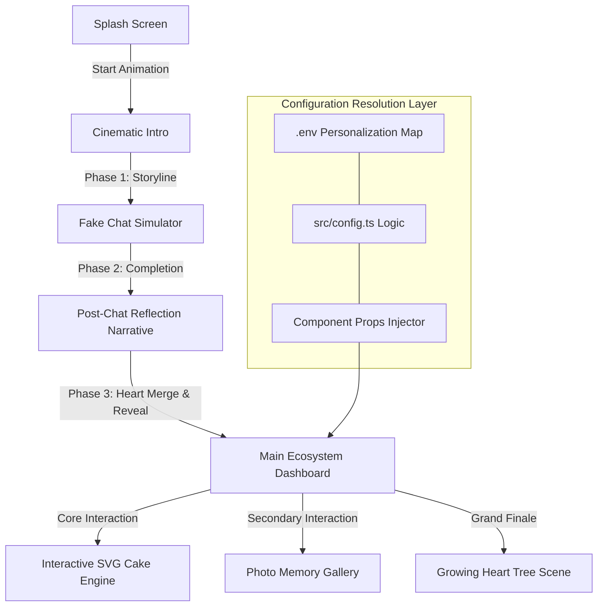
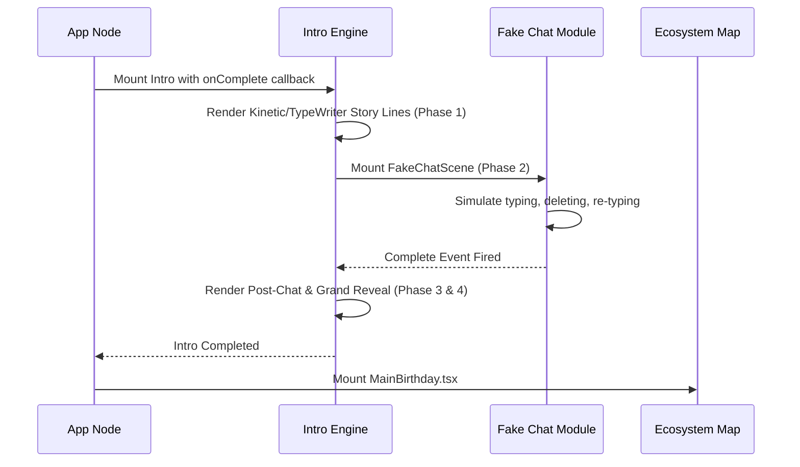

# Birthday Bloom Advanced System Architecture

Welcome to the profound architectural manual for **Birthday Bloom**. This document is tailored for developers who wish to deeply understand the engine, states, and the exact flow of the platform's lifecycle.

---

## 🏗️ High-Level Engine Flow

Birthday Bloom is essentially a deterministic state machine disguised as a web application. It transitions through very specific, locked phases.

---

## 🔄 Component Interaction Sequence

The beauty of the system is how React coordinates timers asynchronously. We intentionally avoid Redux or Context maps to keep the system extremely fast and self-contained per component.

---

## 🧠 Deep Code Explanations

To ensure developers from all backgrounds can comprehend and expand the system, let's break down the major files line by line.

### 1. The Typographic Controller (`TypeWriter.tsx`)
Instant text on the web is boring. The `TypeWriter` component fixes this.

**How it works:**
- It receives a massive string, say: `"Happy Birthday!"`
- It sets a `started` boolean to wait for a specific delay provided by the parent.
- Once `started` is `true`, a recursive `setTimeout` loop activates. It looks at the current `displayed` string (e.g., `"Hap"`) and asks, is this shorter than the target string? If yes, it slices one more character from the target string and pushes it into React state.
- **Why Timeouts over `setInterval`?** Timeouts allow us to vary the speed of individual characters dynamically if we wanted to (e.g., pausing on commas).

### 2. The Chat Simulator (`FakeChatScene.tsx`)
This is pure psychological tension mapping. It doesn't use real WebSockets; it mimics one perfectly.

**How it works:**
- It defines a literal string type: `"appear" | "typing" | "typed" | "cursor-move" | "cursor-hover" | "deleting" | "deleted" | "retype" | "message" | "fadeout"`.
- It calculates the absolute ending time of the previous phase. For instance, `const typeEnd = 1000 + fullText.length * 120;`. It then uses this offset to schedule the "deleting" phase.
- An absolute positioned SVG cursor translates across the DOM simulating an anxious user hovering over the send button before deciding to backspace and send something more emotional.

### 3. The SVG Cake Physics (`CakeCutting.tsx`)
The centerpiece of the application. It looks like a high-end PNG, but it's pure mathematics.

**How it works:**
- The Cake SVG is constructed inside a `<svg>` wrapper.
- Instead of keeping the cake whole, it builds the **Left Half** and the **Right Half** in completely separate SVG `<g>` groups.
- When the slice state hits `"cutting"`, a CSS transform applies a slight negative X-translation and slight negative rotation to the left half, and the inverse to the right half.
- **Why SVG?** SVGs are infinitely scalable math. They will never pixelate on a 4K monitor or an iPhone Pro. They also require practically zero memory overhead compared to massive bitmap textures.

### 4. The Organic Engine (`HeartTree.tsx`)
The final curtain call of the birthday experience. A tree grows from nothing.

**How it works:**
- We map out SVG paths dynamically using Bézier curves (`Q` and `M` properties). 
- We use the trick of tying CSS `stroke-dasharray` and `stroke-dashoffset` to CSS transitions. When the `stroke-dashoffset` animates from max length to 0, the browser visually draws the line.
- Leaves (which are actually Heart SVGs) are grouped with absolute `scale(0)` values. Timers shift those values to `scale(1)` triggering an organic "pop" across the tree canopy.

---

## 📱 Mobile-First Paradigm Guardrails

You'll notice extensive use of `overflow-hidden`, `max-w-full`, and `break-words` in parent containers—especially where `TypeWriter` is hosted.

**The Typographic Reflow Problem:**
When characters are typed into the DOM sequentially, a wrapper div without strict `min-height` and constraints will expand both horizontally and vertically. On mobile, this causes the screen to infinitely shake horizontally as the device scroll boundary fights the DOM mutation. Our implementation locks the boundary and forces wrapping, ensuring 0 jitter.

---

## 🚀 Advanced Deployment Dynamics

When building this locally with `vite run dev`, it parses instantly. In production on Vercel:
1. `vite build` minifies the React files, effectively dead-code eliminating packages we don't import.
2. SVGs are inlined into the JS payloads if they are small enough, avoiding costly HTTP requests to fetch assets.
3. Framer Motion trees and classes are flattened to native CSS, providing pure browser GPU offloading on mobile devices.

By studying this architecture, you now wield the knowledge to modify the exact pacing of the introduction or design entirely new SVG physics ecosystems to add to the dashboard.
